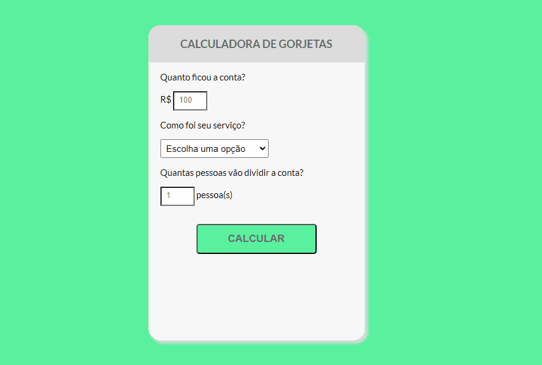

# Calculadora de gorjeta

Projeto desenvolvido para calcular o valor de uma determinada gorjeta, baseado na avaliação do serviço prestado. A calculadora faz o calculo de acordo com a satisfação do cliente. 

## Preview

[]

## Linguagens Utilizadas:

- HTML
- CSS
- Javascript

